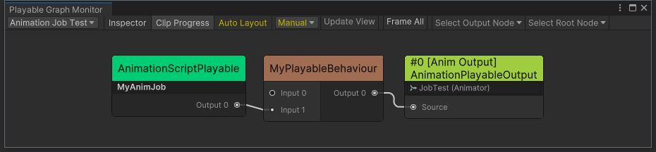
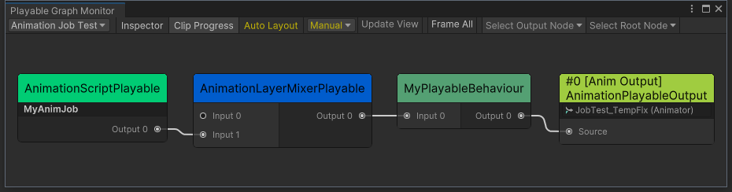

# Unity-Bug-Report-Playable-IN-39561

## About this issue

If the `AnimationScriptPlayable` is output to a `ScriptPlayable` and it is not the **first** input of the `ScriptPlayable`,
the `ProcessRootMotion` and `ProcessAnimation` methods of the AnimationJob will not be executed.

## How to reproduce

1. Open the "SampleScene".
2. Enter play mode.
3. In the Game view, you will see "Connect to Port 0" and the value of the counter is increasing.
4. Click the "Switch Connection" button, and you will see "Connect to Port 1" and the value of the counter has **unexpectedly** stopped increasing.

View the topology of the PlayableGraph in the [PlayableGraph Monitor](https://github.com/SolarianZ/UnityPlayableGraphMonitorTool) (Tools/Bamboo/PlayableGraph Monitor). 

## Solution

You can temporarily fix this issue by inserting an `AnimationLayerMixerPlayable` between the `ScriptPlayable` and the `AnimationScriptPlayable`.

Please refer to [AnimationJobTest_TempFix.cs](./Assets/AnimationJobTest_TempFix.cs) for more details.

